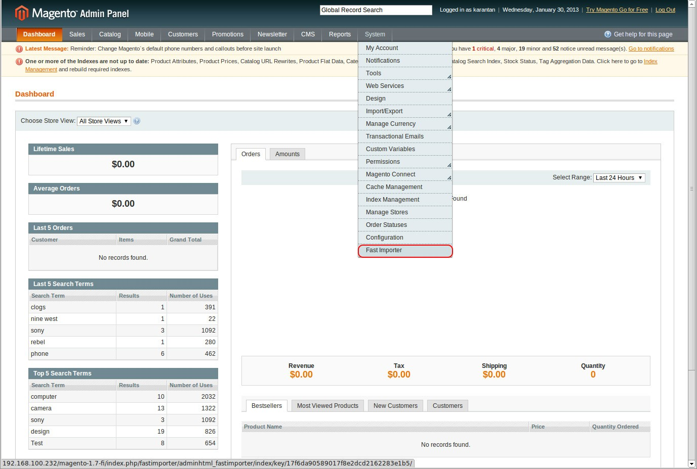
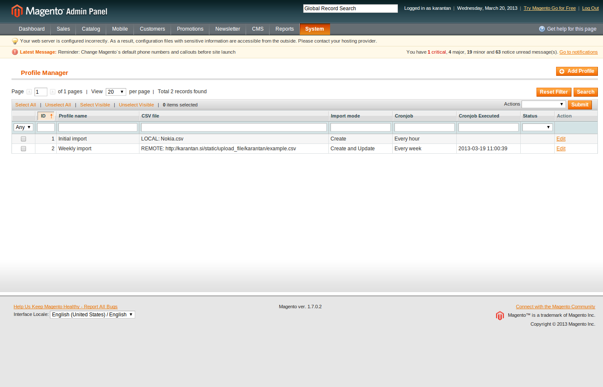
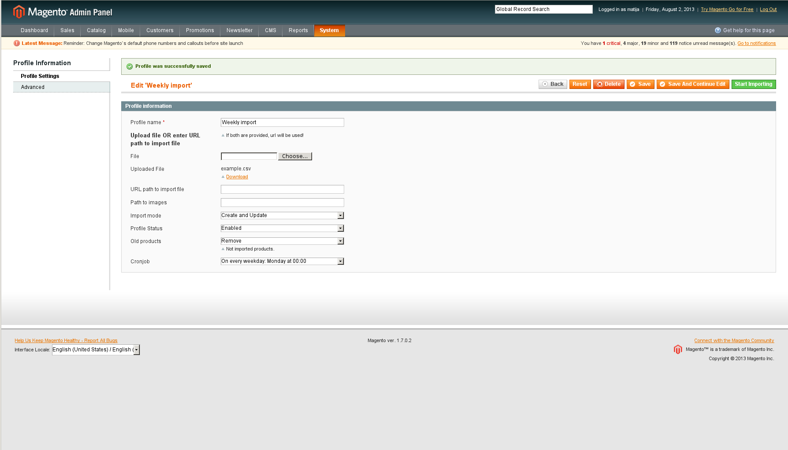
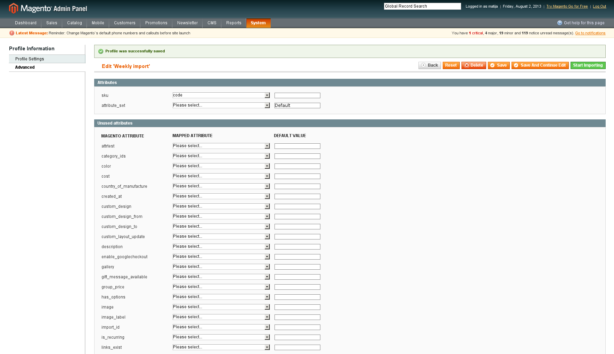
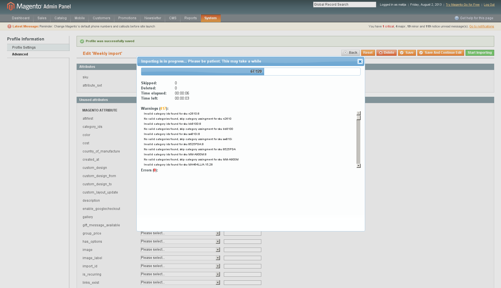

# Installation manual
## Instalation
After you extract archive you must:
1. Open “root” folder and select all folders.
2. Copy & paste them into your magento store root folder (where you also have folder “app”, “js”, “skin”, “var” and others)
3. When asked if you want to merge and/or replace files click yes to all.
4. Make sure you have read and write permissions to folders “magmi” and “media”.
```bash
$ chmod -R 777 magmi
$ chmod -R 777 media
```
5. Go to magento backend and clear all cache.

## Usage
Magento Fast Product Importer is very easy to
use. In the next sections we will show you how
to use it.

First go to Fast Importer Index page:


### Profiles
You can create different profiles to fit your needs.

Each profile has its own import file so if you have e.g. 3 suppliers (supplier A,
supplier B and supplier C) you can create 3 profiles so each supplier has his
own import profile and you can run them seperately.


### CSV structure
Before we begin adding profiles we must define data type and structure for the import file.

Import file type is CSV (stands for comma-seperated values – [Wikipedia](https://en.wikipedia.org/wiki/Comma-separated_values). It uses comma (“,”) for delimiters and quoted field as text.

Here is a list of attributes for the CSV file:

**Table: General Attributes**

|Attribute name | Attribute description | Value | Required|
|---|---|---|---|
name | The name of the product.This name is visible on your product description page as well as anywhere this product is listed. It is used by customers to identify the product | text | yes 
description | Description of the product. This is an important text field, especially as a selling tool, because it is the main way customers learn about the product. | text | yes 
short_description | A shorter description of the product that customers will immediately see when viewing the product description page. | text | yes 
sku |The Stock-Keeping Unit. This is the unique alphanumeric alphanumeric identifier that you use to track this product and its quantity in your inventory system. <br>Note: SKU supports up to 64 alphanumeric characters. Import will fail if it encounters SKU values that are more than 64 characters. |alphanumeric (A-Z,0-9)|yes
type|Specifies the type of product. This field indicates whether this product is a simple or complex product—complex products being those that require additional configuration. Product types include: simple - Physical items that are generally sold as single units or in fixed quantities. configurable - A product with variations that the customer has the option to select.|simple<br> group<br> configurable|yes
weight|The product weight in determined by the shipping provider selected.|Numeric value|yes
news_from_date|This field specifies the “from” date that the product is considered new, and would be featured in your “new products” listings.|Date and Time|no
news_to_date|This field specifies the “to” date that the product is considered new, and would be featured in your “new products” listings.|Date and Time|no
websites|Refers to the Main Website in the Manage Stores section.|base|yes
status|If set to “enabled,” the product will be available 1, 0 for sale in our store. If set to “disabled,” the prouduct will not appear in your catalog.|1, 0|yes
url_key|The URL key (or the product identifying portion) of the product’s web address. For example, if the URL key is “my-sample-product,“ then the address might be: “example.gostorego.com/category/my-sample-product.html”|text|no
visibility|Specify whether this product is visible from the catalog, search, both, or neither.|1 = Not visible <br> 2 = Catalog<br> 3 = Search<br> 4 = Catalog, Search|yes
gift_message_available|This field specifies if a message can be included with this product purchase. If left blank, will use the default configuration. (See: System > Configuration > Sales > Gift Option )|0 = no <br> 1 = yes <br> \[blank\] = (uses default)|no
is_imported|Specify if this product can be included in product RSS feeds by setting this to either “yes” or “no.”|yes, no|no

**Table: Price Attributes**

|Attribute name | Attribute description | Value | Required|
|---|---|---|---|
|price|The price the product is on sale for.|Numeric value|yes|
|special_price|The special sale price for the product during the special sale period.|Numeric value|no|
|special_from_date|Specifies the beginning date that the product is available at the special sale price. The date can be entered in either a 12- or 24-hour format, and can optionally include the time. Click the calendar button to select the date, or enter the date and time using one of the available formats.|Date and Time<br>formats:<br>MM/DD/YYYY<br>hour:minute:sec<br>onds<br>AM or PM<br><br>Examples:<br>8/21/2012<br>12:00:00 AM<br>(midnight)<br>8/21/2012<br>24:00:00<br>(midnight)<br>8/21/2012<br>12:00:00 PM<br>(noon)|no|
|special_to_date|||no|
|tax_class_id|Specify the tax class ID, which will determine which tax rules to apply to the product.|integer based on id # next to each product tax class. (Admin > Sales > Tax >|yes|
|enable_googlecheckout|Determines whether the product can be purchased using Google Checkout. This field can be set to either yes or no.|yes, no|no|

**Table: Meta Information Attributes**

|Attribute name | Attribute description | Value | Required|
|---|---|---|---|
|meta_title|The meta title of the product. This meta title is not visible on your web store, only to search engines.|text|yes|
|meta_keyword|The meta keywords of the product. These keywords are not visible on your web store, only to search engines.|text|no|
|meta_description|The meta description of the product . This description is not visible on your web store, only to search engines.|text|no|

**Table: Images Attributes**

|Attribute name | Attribute description | Value | Required|
|---|---|---|---|
|image|The URL (address) of the base image, or the main image of the product that is displayed when customer clicks the image in the description page.|url|yes|
|thumbnail|The URL (address) of the thumbnail image, or the product image that is shown in product listings.|url|no|
|small_image|The URL (address) of the small image, or the url image that will be displayed in the product description page.|url|no|

**Table: Preloaded Attributes**

|Attribute name | Attribute description | Value | Required|
|---|---|---|---|
|color|The color of the product. This is especially useful for identification and description when you have multiple colors of the same product.|text|no|
|cost|The cost of the product. For internal purposes only.|Numeric value|no|
|manufacturer|The name of the manufacturer of the product. This field can be used by customers to narrow search results to specific manufacturers.|text|no|

####Custom Attributes
Custom attributes are any attributes that you create yourself. Attributes can be
created for organization and product management, as well as to be used for
comparing certain types of products. For example, a store carrying electronics,
including hard drives, would certainly want to create a disk space attribute
that would be used to define and compare hard drive storage sizes.

####Configurable Products
Configurable products MUST be listed in CSV AFTER the simple products so
the module can linke the products.

####Group Products (NEW in v1.3)
Product type must be grouped and the grouped product must have column
grouped_skus with list of skus sperated with comma.

For more details see example CSV.

####Tier Prices (NEW in v1.3)
The syntax for quantities is:

"sku","tier_price:groupA","tier_price:groupB"
"0001","20:10.00;40:9.00;90:8.00","20:11.00;40:10.00;90:9.00"

You can replace **groupA** with **_all_** and the rule will apply to all groups.
For more details see example CSV files.

###Creating new profile
Once you have your CSV file we can create new profile. On the Index page
click Add Profile button.

In field “Profile name” enter name of your new profile (e.g. Initial import),
then choose your CSV file and path to images. CSV file and images can be
locally (e.g. “var/import”) or URL path to remote file (images must be in .zip
archive). Then choose import type. We have 5 import types:

- Create new, skip existing (xcreate)
- Create and Update (create)
- Update existing, skip new (update)
- Delete (NEW in 1.3)
    - in delete mode you can only have “sku” column
- Delete All Products (NEW in 1.3)
    - see example csv for the structure
    
Profile status enables or disables the profile.

With 'old products' you can disable or remove old products. Old products are
imported products which aren't in csv/xls/... anymore. This option doesn't
affect to manually added products or products from other imports.

The last field is Cronjob (new in v1.2). Here you can set how often this profile
will be ran. At the moment we have 6 options.

1. Never
2. At every minute
3. At every full hour
4. On every day at 00:00
5. On every weekday: Monday at 00:00
6. On day 1 every month at 00:00



###Edit profile
After creating new profile you can check what attributes has Fast Product
Importer detected under “Advanced” tab.



If column name in csv/xls is different than magento attribute code, you can
map it to correct attribute.

Second column is default value for attribute. This value is used, when attribute
is missing in import file.

**Note:** If you are importing xml file, you must map all attributes!

Do not forget to save after the changes.

###Run import on specific profile
Check if everything is in order then click “Start Importing” button (the green
one in the button section).

You will see progress pop-up window appear. Do NOT close this window
because the process will be interrupted.



During the import you can see number of already processed products, import
duration, warnings and errors.

When importing is finished, go to your product page and recheck if everything
is in order.